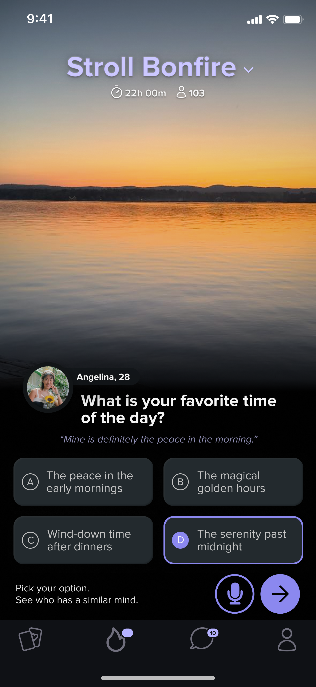
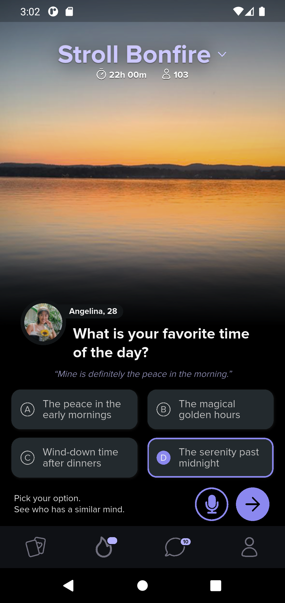

# Stroll Demo

A Flutter application demonstrating clean UI/UX principles.

---

## Screenshots

<table>
  <tr>
    <td align="center">App Screen (iOS)</td>
    <td>&nbsp;&nbsp;&nbsp;</td>
    <td align="center">Figma Design</td>
    <td>&nbsp;&nbsp;&nbsp;</td>
    <td align="center">App Screen (Android)</td>
  </tr>
  <tr>
    <td></td>
    <td>&nbsp;</td>
    <td></td>
    <td>&nbsp;</td>
    <td></td>
  </tr>
</table>

---

## Project Structure

```text
lib/
  ├── l10n/                 # Localization files (ARB)
  ├── screens/              # UI for different screens
  │   └── home.dart         # Home screen UI and logic
  ├── theme/                # Application theme and styling
  └── main.dart             # Entry point of the application
assets/
  ├── icons/                # SVG icons
  ├── images/               # Images (PNG)
  └── screenshots/          # Screenshots for README
```

---

## Getting Started

### Prerequisites

- Flutter SDK: Ensure you have a recent version of Flutter installed. You can
find the installation guide [guide](https://docs.flutter.dev/get-started/install).
- Dart SDK: (Comes with Flutter) The project uses Dart SDK `^3.7.2` as specified
in `pubspec.yaml`.
- Code Editor: [VS Code](https://code.visualstudio.com/) or
[Android Studio](https://developer.android.com/studio) are recommended.

---

## Requirements

- Flutter version

```bash
  Flutter 3.29.2 • channel stable • https://github.com/flutter/flutter.git
  Framework • revision c236373904 (3 months ago) • 2025-03-13 16:17:06 -0400
  Engine • revision 18b71d647a
  Tools • Dart 3.7.2 • DevTools 2.42.3
```

```bash
environment:
  sdk: ^3.7.2
```

## Installation

1. **Clone the repository:**
   Replace `YOUR_USERNAME/stroll_demo.git` with the actual repository URL.

   ```bash
   git clone https://github.com/YOUR_USERNAME/stroll_demo.git
   cd stroll_demo
   ```

2. **Install dependencies:**

   ```bash
   flutter pub get
   ```

3. **Generate localization files:**
   This step is usually run automatically by Flutter tools when needed, but you
   can run it manually:

   ```bash
   flutter gen-l10n
   ```

   If your project uses other code generation tools
   (e.g., `build_runner` for `freezed`, `json_serializable`), run:

   ```bash
   flutter pub run build_runner build --delete-conflicting-outputs
   ```

4. **Run the application:**

   ```bash
   flutter run
   ```

---

## Testing

To run all unit and widget tests:

```bash
flutter test
```

---

## Contributing

Contributions are welcome! Please follow these steps:

1. Fork the repository.
2. Create a new branch for your feature:

   ```bash
   git checkout -b feature/your-feature-name
   ```

3. Make your changes and commit them:

   ```bash
   git commit -m "Add your descriptive commit message here"
   ```

4. Push your changes to your forked repository:

   ```bash
   git push origin feature/your-feature-name
   ```

5. Open a Pull Request against the main repository.

---

## License

This project is licensed under the MIT License.
